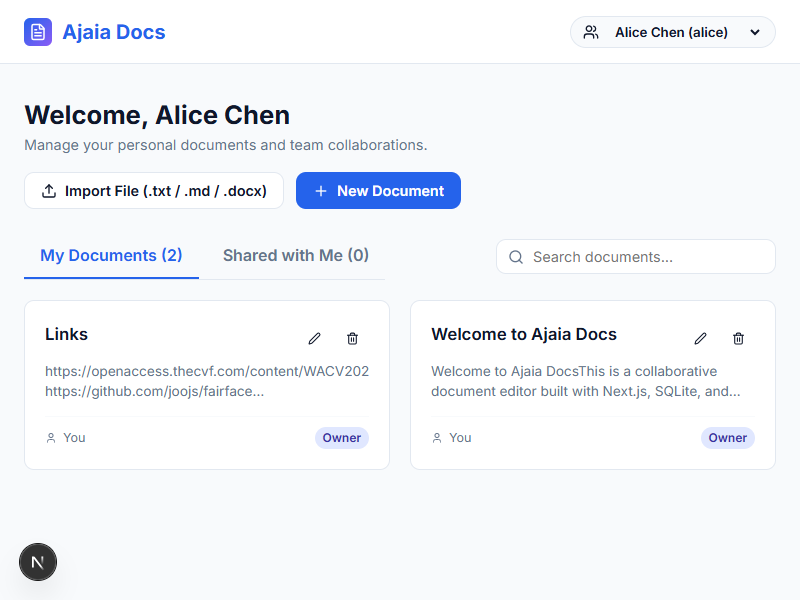
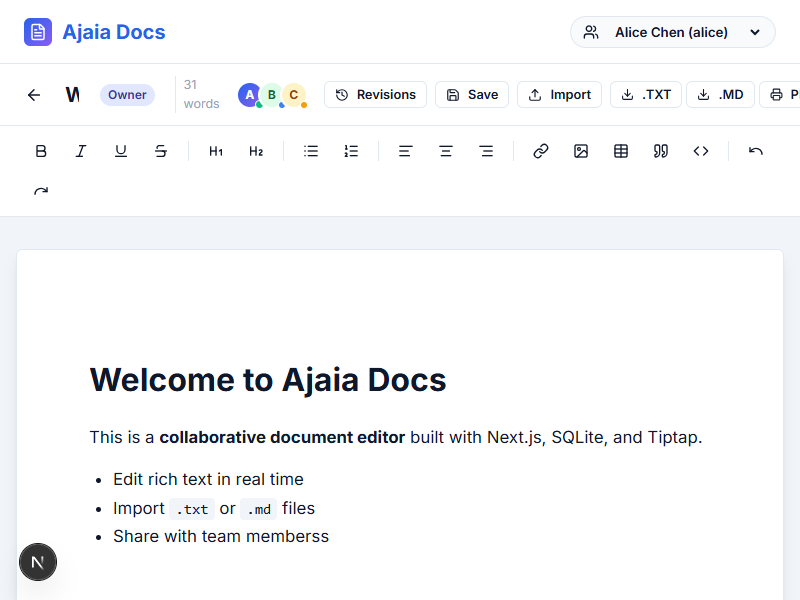
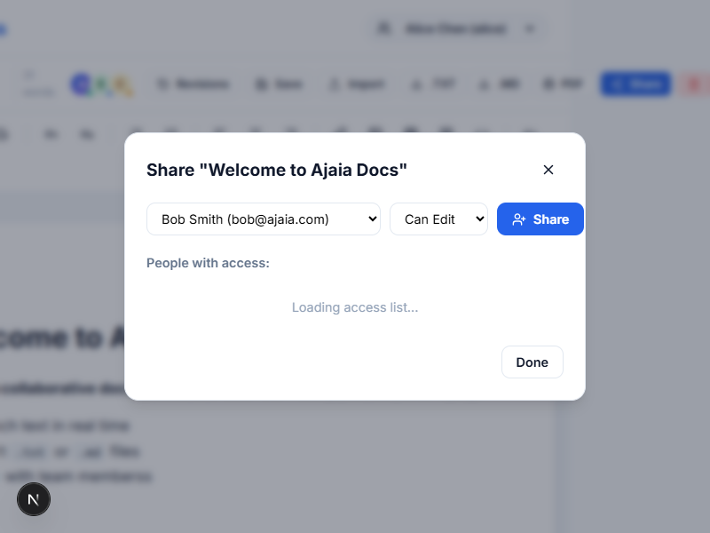

# Ajaia Docs - Collaborative Document Editor

A lightweight, high-performance collaborative document editor inspired by Google Docs, built with Next.js App Router, SQLite, and Tiptap.





## Features

- **Rich-Text Editor**: Create, rename (inline from dashboard or editor), edit, and auto-save rich text documents with support for **Bold**, *Italic*, <u>Underline</u>, ~~Strike~~, Headings (H1/H2), Bulleted/Numbered Lists, Blockquotes, Code Blocks, Hyperlinks, Images, Tables (with +Row, +Col, -Row, -Col controls), and Text Alignment (Left, Center, Right).
- **Version History & Snapshot Restore**: Automatic revision snapshots in SQLite + Version History modal to preview and restore past document versions.
- **File Upload & Import**: Import `.txt`, `.md` (Markdown), or `.docx` (Microsoft Word) files to generate new documents or append into existing drafts.
- **File Export**: Export documents directly to plain text (`.txt`), Markdown (`.md`), or PDF (`.pdf`).
- **Sharing & Access Control**: Grant **Can Edit** or **Can View** access to teammates (Alice, Bob, Charlie) with enforced permission guards.
- **Collaborator Presence**: Active collaborator avatars in header showing online presence and permission badges.
- **Owned vs Shared Workspaces**: Instant tabbed view distinguishing personal documents from team collaborations.
- **Multi-Tab & Cross-Browser Sync**: Automatic polling and focus listeners keep documents synced across tabs and windows.
- **Persistence**: Fast local SQLite storage (`ajaia.db`) with auto-seeding sample users and documents.
- **Automated Testing**: Unit test suite powered by Vitest verifying document access control rules.

---

## Quick Start & Setup Instructions

### Prerequisites
- Node.js 18+
- npm 9+

### 1. Install Dependencies
```bash
npm install
```

### 2. Run Development Server
```bash
npm run dev
```
Open [http://localhost:3000](http://localhost:3000) in your browser.

### 3. Run Automated Tests
```bash
npm run test
```

### 4. Build for Production
```bash
npm run build
npm start
```

---

## Architecture Note

### Why Next.js + SQLite?
- **Single Process Efficiency**: Next.js App Router provides unified client rendering and backend API routes in a single codebase, eliminating CORS overhead.
- **Zero-Config Storage**: SQLite (`better-sqlite3`) provides synchronous, reliable, zero-latency local relational storage stored in `ajaia.db`.
- **Modularity**: Business logic and access control rules are centralized in `lib/documents.js`, making them fully testable via Vitest independently of React UI components.

---

## AI-Native Workflow Note

- **AI Tools Used**: Google Antigravity AI coding assistant with automated code generation, linting, and background task execution.
- **Material Time Savings**:
  - Accelerated initial Next.js project bootstrap and SQLite schema definition.
  - Rapid setup of Tiptap editor extension integration (Tables, Links, Images, Alignment) and custom toolbar components.
  - Quick drafting of responsive CSS design tokens and layout styling.
- **AI Output Refinements**:
  - Pure JavaScript refactoring (`.js` / `.jsx`) eliminating TypeScript boilerplate and build noise.
  - Integrated `mammoth` and `marked` for client-side Word `.docx` and Markdown parsing.
- **Verification Strategy**:
  - Automated unit testing with `vitest` for permission logic.
  - Strict build validation using `npm run build` with static analysis.
